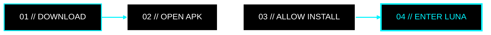

<div align="center">

<!-- ========================================================= -->
<!--                   LUNA // OLED NEON                       -->
<!-- ========================================================= -->

<a href="https://github.com/VoTruongDanh/Luna-releases">
  
</a>

<br/>

<!-- ANIMATED HERO -->
<a href="https://github.com/VoTruongDanh/Luna-releases">
  
</a>

<p>
  <code>UNIVERSAL MEDIA EXPERIENCE</code>
  &nbsp;•&nbsp;
  <code>ANDROID</code>
  &nbsp;•&nbsp;
  <code>ZERO ADS</code>
</p>

<h3>
  Phát nội dung theo cách nó nên được phát.
</h3>

<p>
  Không quảng cáo. Không gián đoạn. Không thừa thãi.
  <br/>
  <b>Chỉ còn bạn và nội dung.</b>
</p>

<br/>

<!-- BADGES -->
<a href="https://github.com/VoTruongDanh/Luna-releases/releases">
  
</a>


<br/><br/>

<!-- PRIMARY CTA -->
<a href="https://github.com/VoTruongDanh/Luna-releases/releases">
  
</a>

<br/><br/>


</div>

<br/>

## `01 // LUNA`

> **LUNA** được xây dựng với một nguyên tắc rất đơn giản:
>
> **Media player phải biến mất để nội dung trở thành trung tâm.**

Không banner chiếm màn hình.  
Không video quảng cáo chen ngang.  
Không giao diện rối mắt.  
Không thao tác dư thừa.

```text
┌───────────────────────────────────────────────┐
│                                               │
│   L U N A   //   U N I V E R S A L           │
│                                               │
│   STATUS       ● ONLINE                       │
│   ADS          0                              │
│   BACKGROUND   ENABLED                        │
│   UPDATE       OTA                            │
│   UI           OLED / MONOCHROME              │
│                                               │
│   > PRESS PLAY_                               │
│                                               │
└───────────────────────────────────────────────┘
```

---

## `02 // CORE FEATURES`

<table>
<tr>

<td width="50%" valign="top">

### `01` ZERO ADS

**Không quảng cáo. Thực sự.**

- Không video quảng cáo chen ngang.
- Không banner phá vỡ giao diện.
- Không pop-up làm gián đoạn trải nghiệm.
- Tập trung hoàn toàn vào nội dung đang phát.
- Giảm lượng dữ liệu không cần thiết.

> `CONTENT > ADVERTISEMENT`

</td>

<td width="50%" valign="top">

### `02` BACKGROUND PLAY

**Tắt màn hình. Âm thanh vẫn tiếp tục.**

- Phát audio khi ứng dụng chạy nền.
- Tiếp tục nghe khi khóa màn hình.
- Điều khiển trực tiếp từ notification.
- Hỗ trợ tai nghe và Bluetooth.
- Trải nghiệm phù hợp cho nhạc & podcast.

> `SCREEN OFF // AUDIO ON`

</td>

</tr>

<tr>

<td width="50%" valign="top">

### `03` OTA UPDATE

**Cập nhật ngay bên trong LUNA.**

- Tự động kiểm tra phiên bản.
- Hiển thị changelog.
- Tải APK phiên bản mới.
- Cài đặt chỉ với vài thao tác.
- Hỗ trợ bản cập nhật bắt buộc khi cần thiết.

> `CHECK → DOWNLOAD → UPDATE`

</td>

<td width="50%" valign="top">

### `04` OLED INTERFACE

**Black means black.**

- Giao diện tối ưu cho OLED / AMOLED.
- Nền đen sâu.
- Icon monochrome.
- Độ tương phản cao.
- Tập trung vào khả năng đọc và nội dung.

> `#000000 + #FFFFFF + NEON`

</td>

</tr>
</table>

---

<div align="center">

## `03 // GET LUNA`

### QUÉT QR • TẢI APK • CÀI ĐẶT

<br/>

<a href="https://github.com/VoTruongDanh/Luna-releases/releases">
  
</a>

<br/><br/>

`SCAN TO ENTER LUNA`

<br/><br/>

<a href="https://github.com/VoTruongDanh/Luna-releases/releases">
  
</a>

<br/><br/>

<sub>
QR Code và nút phía trên dẫn tới khu vực phát hành chính thức của LUNA.
</sub>

</div>

---

## `04 // INSTALL`



### Cài đặt thủ công

**01.** Mở trang **Releases**.

**02.** Tải file `.apk` mới nhất.

**03.** Nếu Android yêu cầu, bật quyền:

```text
Allow installation from this source
```

**04.** Cài đặt và mở **LUNA**.

<div align="center">

<a href="https://github.com/VoTruongDanh/Luna-releases/releases">
  
</a>

</div>

---

## `05 // EXPERIENCE`

```text
                         ┌─────────────┐
                         │    LUNA     │
                         └──────┬──────┘
                                │
                ┌───────────────┼───────────────┐
                │               │               │
                ▼               ▼               ▼
          ┌──────────┐    ┌──────────┐    ┌──────────┐
          │ ZERO ADS │    │ OLED UI  │    │ OTA CORE │
          └────┬─────┘    └────┬─────┘    └────┬─────┘
               │               │               │
               └───────────────┼───────────────┘
                               │
                               ▼
                     ┌──────────────────┐
                     │ BACKGROUND MEDIA │
                     └────────┬─────────┘
                              │
                              ▼
                    ┌────────────────────┐
                    │ PURE MEDIA / 24×7  │
                    └────────────────────┘
```

---

## `06 // WHY LUNA`

| | LUNA |
|---|---|
| **Quảng cáo** | `ZERO` |
| **Phát nền** | `ENABLED` |
| **Tắt màn hình** | `ENABLED` |
| **OTA Update** | `ENABLED` |
| **OLED UI** | `ENABLED` |
| **Mini Player** | `ENABLED` |
| **Media Notification** | `ENABLED` |
| **Chi phí** | `FREE` |

---

## `07 // RELEASE CHANNEL`

<div align="center">

<a href="https://github.com/VoTruongDanh/Luna-releases/releases">
  
</a>

<a href="https://github.com/VoTruongDanh/Luna-releases/releases">
  
</a>

<a href="https://github.com/VoTruongDanh/Luna-releases">
  
</a>

</div>

---

## `08 // DESIGN LANGUAGE`

```text
COLOR SYSTEM
────────────────────────────────────────

PURE BLACK      #000000
SOFT BLACK      #050505
PURE WHITE      #FFFFFF
NEON CYAN       #00F5FF

────────────────────────────────────────
NO PURPLE.
NO RED.
NO RANDOM GRADIENT.
NO VISUAL NOISE.
────────────────────────────────────────
```

LUNA sử dụng một ngôn ngữ thiết kế tối giản:

**Black** cho không gian.  
**White** cho thông tin.  
**Neon Cyan** cho hành động.

Không sử dụng màu sắc chỉ để trang trí.

---

<div align="center">


<br/>

```text
──────────────────────────────────────────────────────────
                    L U N A
        PLAY MORE. SEE LESS. HEAR EVERYTHING.
──────────────────────────────────────────────────────────
```

<a href="https://github.com/VoTruongDanh/Luna-releases/releases">
  
</a>

<br/><br/>

<sub>
Made for a quieter media experience.
</sub>

<br/><br/>


</div>
