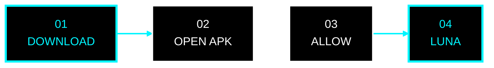

<div align="center">

<!-- ═══════════════════════════════════════════════════════ -->
<!--                    LUNA // NEON CORE                   -->
<!-- ═══════════════════════════════════════════════════════ -->


<a href="https://github.com/VoTruongDanh/Luna-releases">
  
</a>

<br/>


<br/>

<code>◉ ONLINE</code>
&nbsp;&nbsp;
<code>◉ ZERO ADS</code>
&nbsp;&nbsp;
<code>◉ BACKGROUND PLAY</code>
&nbsp;&nbsp;
<code>◉ OTA READY</code>

<br/><br/>

<a href="https://github.com/VoTruongDanh/Luna-releases/releases">
  
</a>


<br/><br/>

<a href="https://github.com/VoTruongDanh/Luna-releases/releases">
  
</a>

<br/><br/>

<strong>PLAY MORE. SEE LESS. HEAR EVERYTHING.</strong>

</div>

---

<div align="center">

## `01 // SYSTEM`

</div>

```text id="cyber001"
╭──────────────────────────────────────────────────────────╮
│                                                          │
│       ██╗     ██╗   ██╗███╗   ██╗ █████╗                │
│       ██║     ██║   ██║████╗  ██║██╔══██╗               │
│       ██║     ██║   ██║██╔██╗ ██║███████║               │
│       ██║     ██║   ██║██║╚██╗██║██╔══██║               │
│       ███████╗╚██████╔╝██║ ╚████║██║  ██║               │
│       ╚══════╝ ╚═════╝ ╚═╝  ╚═══╝╚═╝  ╚═╝               │
│                                                          │
│       UNIVERSAL MEDIA ENGINE                             │
│                                                          │
│       STATUS        [ ONLINE ]                           │
│       ADS           [ 0 ]                                │
│       AUDIO         [ BACKGROUND ENABLED ]               │
│       DISPLAY       [ OLED / AMOLED ]                    │
│       UPDATE        [ OTA READY ]                        │
│                                                          │
│       > media_without_distractions_                      │
│                                                          │
╰──────────────────────────────────────────────────────────╯
```

---

<div align="center">

## `02 // CORE`

</div>

<table>
<tr>

<td width="50%" valign="top">

<h3>◈ ZERO ADS</h3>

Không video quảng cáo chen ngang.

Không banner phá vỡ trải nghiệm.

Không pop-up không cần thiết.

<br/>

<code>CONTENT &gt; ADS</code>

</td>

<td width="50%" valign="top">

<h3>◈ BACKGROUND PLAY</h3>

Nghe khi chuyển ứng dụng.

Nghe khi khóa màn hình.

Điều khiển từ notification và Bluetooth.

<br/>

<code>SCREEN OFF // AUDIO ON</code>

</td>

</tr>

<tr>

<td width="50%" valign="top">

<h3>◈ OTA ENGINE</h3>

Tự động kiểm tra phiên bản mới.

Hiển thị changelog.

Tải bản cập nhật trực tiếp.

<br/>

<code>CHECK → DOWNLOAD → UPDATE</code>

</td>

<td width="50%" valign="top">

<h3>◈ OLED UI</h3>

Nền đen sâu.

Icon monochrome.

Tương phản cao.

Tối ưu OLED / AMOLED.

<br/>

<code>BLACK // WHITE // NEON</code>

</td>

</tr>
</table>

---

<div align="center">


</div>

```text id="cyber002"
[████████████████████████████████████████] 100%

MEDIA ENGINE          ONLINE
BACKGROUND AUDIO      ONLINE
OLED RENDERER         ONLINE
ADVERTISEMENT LAYER   NOT FOUND

> READY_
```

---

<div align="center">

## `03 // DOWNLOAD`

<br/>


<br/>

<a href="https://github.com/VoTruongDanh/Luna-releases/releases">
  
</a>

<br/><br/>

<a href="https://github.com/VoTruongDanh/Luna-releases/releases">
  
</a>


<br/><br/>

<code>github.com/VoTruongDanh/Luna-releases</code>

</div>

---

<div align="center">

## `04 // INSTALL`

</div>



<div align="center">

`DOWNLOAD APK`

↓

`OPEN FILE`

↓

`ALLOW INSTALL FROM THIS SOURCE`

↓

**`ENTER LUNA`**

</div>

---

<div align="center">

## `05 // SUPPORT`


<br/>

<table>
<tr>
<td align="center">


</td>
</tr>
</table>

<br/>

<strong>SCAN TO SUPPORT LUNA</strong>

<br/><br/>

<code>DONATE // SUPPORT // KEEP BUILDING</code>

<br/><br/>

<sub>
LUNA luôn miễn phí. Donate hoàn toàn tự nguyện.
</sub>

</div>

---

<div align="center">


<br/>

```text id="cyber004"
┌──────────────────────────────────────────────────────┐
│                                                      │
│              L U N A   //   READY                    │
│                                                      │
│      ZERO ADS · BACKGROUND · OLED · OTA              │
│                                                      │
└──────────────────────────────────────────────────────┘
```

<a href="https://github.com/VoTruongDanh/Luna-releases/releases">
  
</a>

<br/><br/>

<strong>MEDIA. WITHOUT THE NOISE.</strong>


</div>
