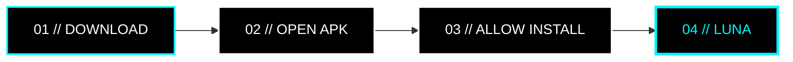

 

  <code>UNIVERSAL MEDIA EXPERIENCE</code>
  &nbsp;•&nbsp;
  <code>ANDROID</code>
  &nbsp;•&nbsp;
  <code>ZERO ADS</code>

<h3>Phát nội dung theo cách nó nên được phát.</h3>

  Không quảng cáo. Không gián đoạn. Không thừa thãi.
   
  <b>Chỉ còn bạn và nội dung.</b>

 

  

---

## `01 // FEATURES`

<table>
<tr>

<td width="50%" valign="top">

### `ZERO ADS`

- Không video quảng cáo chen ngang.
- Không banner làm gián đoạn.
- Giao diện tập trung hoàn toàn vào nội dung.

> `CONTENT > ADVERTISEMENT`

</td>

<td width="50%" valign="top">

### `BACKGROUND PLAY`

- Phát âm thanh khi ứng dụng chạy nền.
- Tiếp tục nghe khi khóa màn hình.
- Điều khiển từ notification và tai nghe Bluetooth.

> `SCREEN OFF // AUDIO ON`

</td>

</tr>

<tr>

<td width="50%" valign="top">

### `OTA UPDATE`

- Tự động kiểm tra phiên bản mới.
- Hiển thị changelog.
- Tải và cài APK trực tiếp.

> `CHECK → DOWNLOAD → UPDATE`

</td>

<td width="50%" valign="top">

### `OLED UI`

- Giao diện đen tối ưu OLED / AMOLED.
- Icon monochrome.
- Độ tương phản cao.
- Tối giản và dễ đọc.

> `BLACK // WHITE // NEON`

</td>

</tr>
</table>

---

## `02 // DOWNLOAD`

### GET THE LATEST LUNA

 

  

<code>GITHUB RELEASES // OFFICIAL DISTRIBUTION</code>

---

## `03 // INSTALL`

1. Mở trang **Releases**.
2. Tải file `.apk` mới nhất.
3. Cho phép cài đặt từ nguồn này nếu Android yêu cầu.
4. Cài đặt và mở **LUNA**.

---

## `04 // SUPPORT LUNA`

### KEEP LUNA FREE

LUNA được phát hành miễn phí.

Nếu bạn muốn hỗ trợ quá trình phát triển,  
có thể **donate trực tiếp qua QR bên dưới**.

 

  

 

<code>SCAN QR // DONATE // SUPPORT DEVELOPMENT</code>

  

Donate hoàn toàn tự nguyện.

---

 

  

PLAY MORE. SEE LESS. HEAR EVERYTHING.

